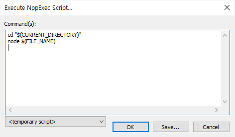
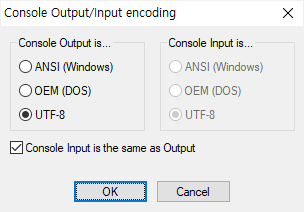

# Nodepad++에서 nodejs 스크립트 실행

NppExec 플러그인을 이용하면 nodejs 스크립트를 실행 할 수 있다.

> - Execute commands or saved scripts without leaving Notepad++.
> - Author: Vitaliy Dovgan
> - Homepage: https://github.com/d0vgan/nppexec


## 1) NppExec 플러그인 설치
플러그인 > 플러그인 관리에서 "NppExec"를 선택하고 설치한다.


## 2) 실행
1. 플러그인 > NppExec > Execute NppExec Script... 메뉴 실행 또는 **단축키 F6**을 누른다.
1. "Execute NppExec Script"에서 아래 스크립트를 입력하고 OK 버튼 클릭하면 실행된다.
    ```
    cd "$(CURRENT_DIRECTORY)"
    node $(FILE_NAME)
    ```

    
1. 플러그인 > NppExec > Execute Previous NppExec Script 메뉴 실행 또는 **단축키 Ctrl+F6**을 누르면 직전에 실행했던 스크립트가 실행된다.


## 추가 설정


## Trouble shooting

- 콘솔창 한글 깨지는 경우
    - 플러그인 > NppExec > Console Output... 메뉴 실행 후 실행 환경에 맞게 인코딩 설정한다.

        


