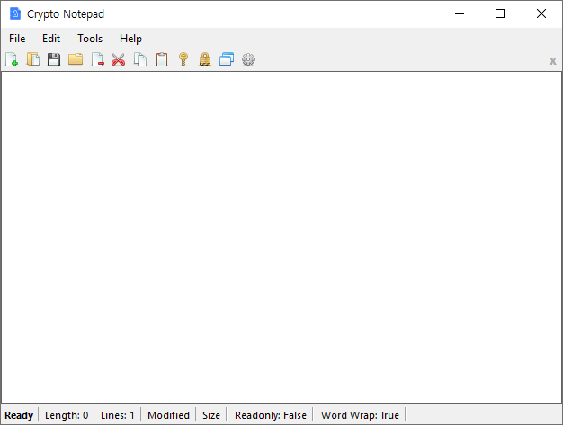
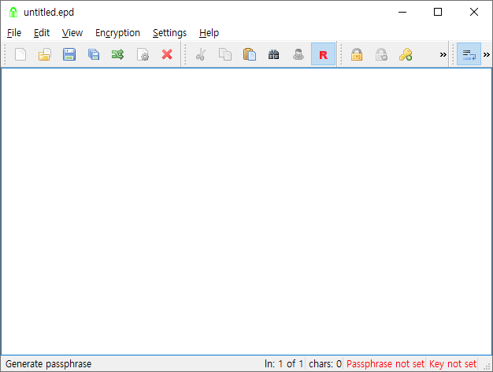
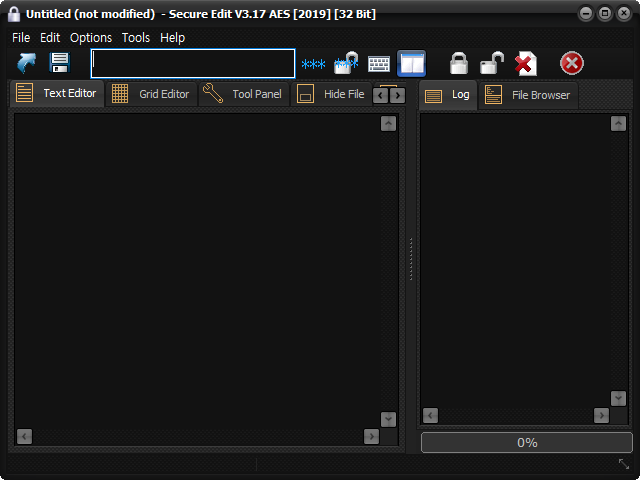
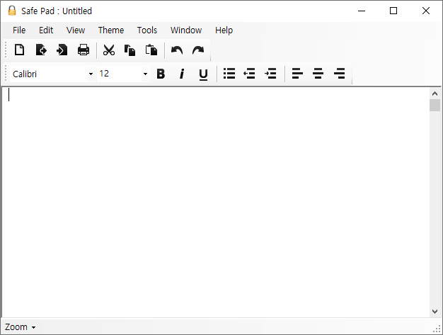
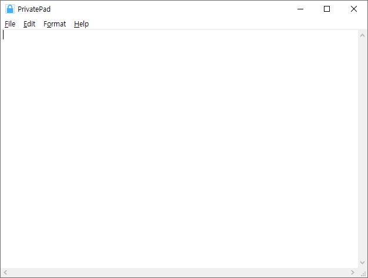
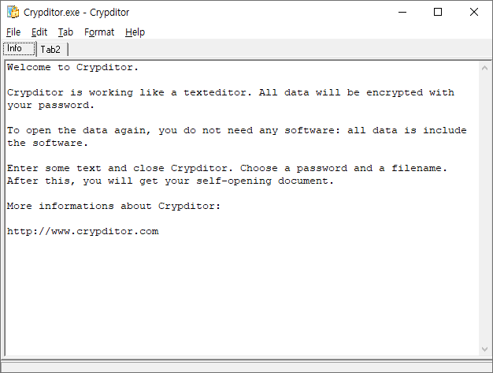
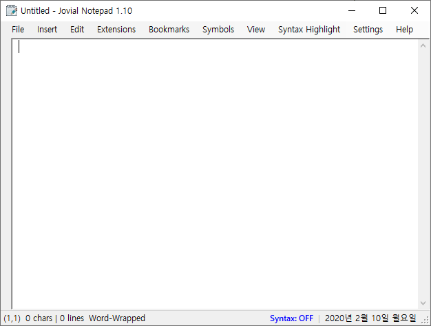

# 암호화&복호화 텍스트 에디터

> 작성일자 : 2020-04-20

### Crypto Notepad 1.6.6
- <https://github.com/Crypto-Notepad/Crypto-Notepad>{:target="_blank"}
- 용량 : 약 3.75MB
- 에디터 기능 : 간단한 텍스트 에디터 기능 괜찮음
- 부가 기능 : 없음
- 장점 : 간단한 텍스트 에디터 기능 괜찮음
- 단점 : 받침있는 한글을 입력하면 자음, 모음이 분리되서 입력됨 (Ex. "한글" 자판 입력하면 "한ㄱㅡㄹ"로 입력됨)
- 기타 : 실행 파일 1개, Windows 7 SP1 and higher, .NET Framework 4.6.1 and higher
- 평가 : ★★★★☆
- {widthX="600px"}

## EncryptPad 0.4.0.4 Beta
- <https://github.com/evpo/EncryptPad>{:target="_blank"}
- 용량 : 30MB
- 에디터 기능 : GOOD
- 부가 기능 : 편집기 확대/축소 기능 등
- 장점 : Multiplatform
- 단점 : Portable로 사용하기에 용량이 너무 크다.
- 기타 : Windows, Linux, Mac OS
- 평가 : ★★★★☆
- {widthX="600px"}

## NPPCrypt 1.0.1.6
- <https://github.com/jeanpaulrichter/nppcrypt>{:target="_blank"}
- 용량 : 2.4MB
- 에디터 기능 : NotePad++
- 부가 기능 : 없음
- 장점 : NotePad++ Plugin
- 단점 : 저장 후 캐럿이 에디터 첫 줄, 첫 번째 컬럼 위치로 이동함
- 평가 : ★★★★☆

## SecureEdit 3.17
- <http://elentaris.co.uk/freeware/>{:target="_blank"}
- 용량 : 6MB
- 에디터 기능 : 
- 부가 기능 : 파일 암호화, 파일 완전 삭제, 임시 파일 삭제, 등등 부가적인 기능 다수 포함
- 장점 : 기능 매우 많음
- 단점 : 기능 매우 많음
- 평가 : ★★★☆☆
- {widthX="300px"}

## Safe Pad 1.3 ★★☆☆☆
- <https://github.com/stephenhaunts/SafePad>{:target="_blank"}
- 용량 : 240KB
- 에디터 기능 : 심플 텍스트 에디터
- 부가 기능 : 없음
- 장점 : 용량 작음
- 단점 : 새 줄에서 영문 입력하면 Calibri 폰트로 바뀜.
- {widthX="300px"}

## PrivatePad 19.12
- <http://www.minaware.com/pad/>{:target="_blank"}
- 용량 : 117KB
- 에디터 기능 : 윈도우 기본 메모장 수준
- 부가 기능 : 없음
- 장점 : 용량 작음
- 단점 : 에디터 기능 너무 약함. 정해진 3개 폰트(Consola, Courier New, Lucida Console)만 선택 가능.
- 평가 : ★☆☆☆☆
- {widthX="300px"}

## SafeNotes 5.0.8
- <https://www.safenotes.org/download/>{:target="_blank"}
- 용량 : 6.5MB
- 윈도우10 에서 실행 안됨
- 평가 : ☆☆☆☆☆

## Crypditor
- <https://www.protectcom.com/crypditor-text-editor-with-high-secure-encryption>{:target="_blank"}
- 용량 : 800KB
- 에디터 기능 : 불편, 탭 분리, 다른 파일로 저장 기능 없음
- 평가 : ★☆☆☆☆
- {widthX="300px"}

## Jovial Notepad 1.10
- <https://sourceforge.net/projects/jovialnotepad/>{:target="_blank"}
- 용량 : 520KB
- 기타 : 워드패드로 저장
- 평가 : ★☆☆☆☆
- {widthX="300px"}

## SecurePad
- <https://github.com/DominicTobias/SecurePad>{:target="_blank"}
- 에디터 기능 : NotePad++
- 부가 기능 : 없음
- 장점 : N/A
- 단점 : 텍스트 내용을 암호화 문자열로 저장하는 구조임. 암호화/복호화 각각 메뉴를 실행해야함.
- 평가 : ☆☆☆☆☆

## MyText 1.4.0
- <http://www.filefriend.net/#MyText>{:target="_blank"}
- 용량 : 약 584KB
- 에디터 기능 : 
- 부가 기능 : 없음
- 장점 : 
- 단점 : 
- 기타 : 실행 파일 1개
- 평가 : 
