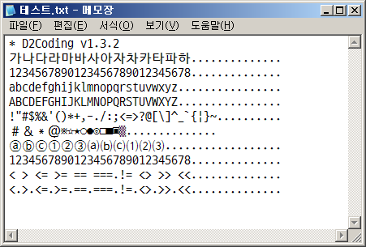
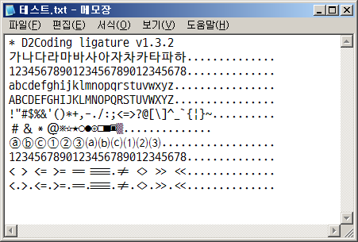
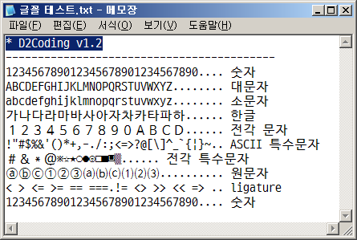
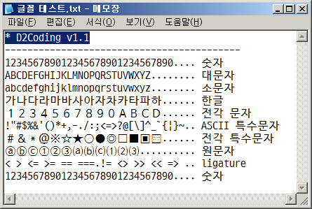
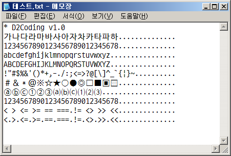

# D2Coding 글꼴

네이버에서 만들어서 무료로 배포하는 개발자용 고정폭 폰트로 회사에서도 사용 가능하다.

v1.2 버전부터는 일부 전각 문자가 반각 문자로 표시되고 있어서 v1.1 버전을 사용하고 있다.

- GitHub : https://github.com/naver/d2codingfont
- Release : https://github.com/naver/d2codingfont/releases
- v1.1 : https://github.com/naver/d2codingfont/releases/tag/VER1.1


### 배포 파일 리스트
- D2Coding-Ver1.3.2-20180524.zip
- D2Coding-Ver1.3.1-20180115.zip
- D2Coding-Ver1.3-20171129.zip
    - powerline 심볼 추가
    - ligature 문자 지원
- D2Coding-Ver1.2-20161021.zip
    - 화살표/박스 등의 아스키 제어문자 31자 추가
- D2Coding-Ver1.1-TTC-20151103.zip
- D2Coding-Ver1.0-TTC-20150911.zip


### 글꼴 테스트용 텍스트
```
* D2Coding v1.1
가나다라마바사아자차카타파하..............
1234567890123456789012345678..............
abcdefghijklmnopqrstuvwxyz................
ABCDEFGHIJKLMNOPQRSTUVWXYZ................
!"#$%&'()*+,-./:;<=>?@[\]^_`{|}~..........
＃＆＊＠※☆★○●◎□■▣▒..............
ⓐⓑⓒ①②③⒜⒝⒞⑴⑵⑶..................
1234567890123456789012345678..............
< > <= >= == ===.!= <> >> << =>...........
<.>.<=.>=.==.===.!=.<>.>>.<<.=>...........
```


### 버전별 글꼴 차이점
| 버전         | 이미지                     |
| ------------ | -------------------------- |
| v1.3.2       |   |
| v1.2         |  |
| v1.1         |  |
| v1.0         |  |

